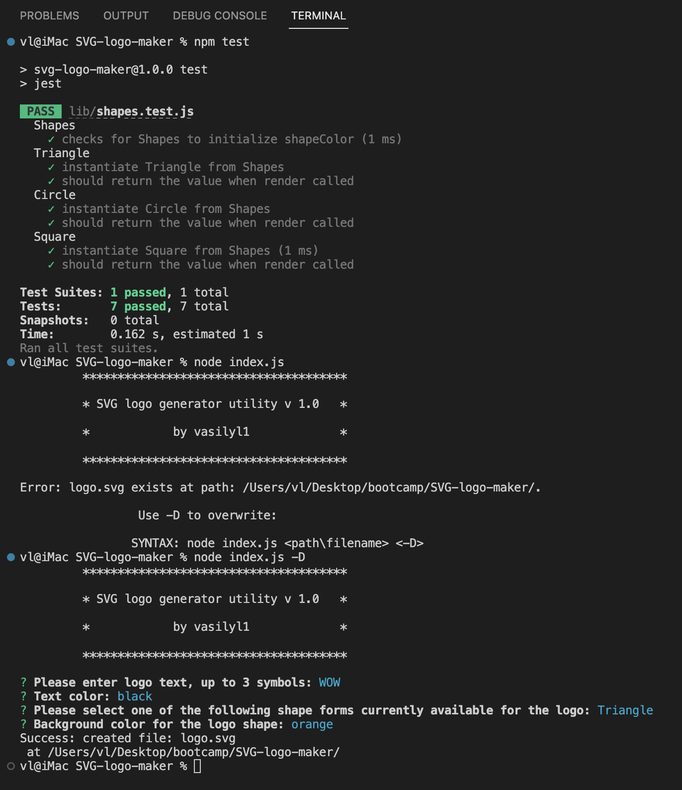

# SVG-logo-maker
Node.js command-line application that takes in user input to generate a logo and save it as an SVG file

## Description

This application runs from the command line and allows to generate a pre-defined SVG logo in a very quick way. The user is interviewed with to get information about the pre-defined shape of the SVG logo - circle, triangle or square, up to 3 symbols to be displayed in the center of the logo form and the color of text and shape. As a result, the logo.svg file is being created and ready to be used after the application ends.

## Table of Contents

  [Title](#title)

  [Description](#description)

  [Installation](#installation)

  [Usage](#usage)

  [License](#license)

  [Contributing](#contributing)

  [Tests](#tests)

  [Questions](#questions)

## Installation

Step 1: clone GitHub repository, for that run the following command from the command line prompt (make sure you navigate to the directory of your choice before start cloning): git clone https://github.com/vasilyl1/SVG-logo-maker

Step 2: navigate to the cloned repositary directory, for that run: cd SVG-logo-maker

Step 3: install the libraries required by the application by running: NPM install

Step 4: launch the app by typing: node index.js 

## Usage

Once the app is launched, if there are no arguments provided (the user types node index.js from SVG-logo-maker directory), the app will check if the file with the default name of logo.svg is present in that directory. If the file is present, the app will suggest to use -D flag to overwrite it or to supply an additional argument which will can change the path and the name of the output file.

The user will be asked a series of the questions to determine the style and the form of the SVG logo, including the text to be displayed in the center of the logo form.
If more than 3 symbols are being supplied for the logo text, the dialog will prevent further questions and will request to enter up to 3 symbols.

The other questions allow to change the form of the logo - pre-defined options include circle, triangle and square, as well as background color of the image and the logo text. The colors can be input in a number of various ways - as a kewords (for exmaple blue, green, orange, white etc.), as a hex numbers (#FFF, etc.) or other more sophisticated ways as for example rgb(255,255,255,1).

Once the questions are answered, the output file is being created at the path specified by the user or in the default directory if nothing has been specified as an argument in a command line. Please note that there is a way to create the files with the different extensions as for example .html file can be created too which may introduce the easier way to be displayed in the browser.

Attached screenshot features on how the interview questions will look like and also allows to see some error diagnostic messages:

The link to the video with the recorded demo of the application is here:

https://watch.screencastify.com/v/QcZ12uPnFN3L0ToljcNw

## Credits

Inquirer library has been used:
https://www.npmjs.com/package/inquirer/v/8.2.4

Color-string parsing library has been used:
https://www.npmjs.com/package/color-string

## License

MIT License

Copyright (c) 2022 vasilyl1

Permission is hereby granted, free of charge, to any person obtaining a copy of this software and associated documentation files (the "Software"), to deal in the Software without restriction, including without limitation the rights to use, copy, modify, merge, publish, distribute, sublicense, and/or sell copies of the Software, and to permit persons to whom the Software is furnished to do so, subject to the following conditions:

The above copyright notice and this permission notice shall be included in all copies or substantial portions of the Software.

THE SOFTWARE IS PROVIDED "AS IS", WITHOUT WARRANTY OF ANY KIND, EXPRESS OR IMPLIED, INCLUDING BUT NOT LIMITED TO THE WARRANTIES OF MERCHANTABILITY, FITNESS FOR A PARTICULAR PURPOSE AND NONINFRINGEMENT. IN NO EVENT SHALL THE AUTHORS OR COPYRIGHT HOLDERS BE LIABLE FOR ANY CLAIM, DAMAGES OR OTHER LIABILITY, WHETHER IN AN ACTION OF CONTRACT, TORT OR OTHERWISE, ARISING FROM, OUT OF OR IN CONNECTION WITH THE SOFTWARE OR THE USE OR OTHER DEALINGS IN THE SOFTWARE.

## Contributing

vl1
  
## Tests

Jest package has been used as a suite of tests:
https://www.npmjs.com/package/jest

During the development of this app, vl1 has been following test driven development (TDD) principle. TDD principle has been found particularly useful in the object oriented programming environment to test the correct inheritance and polymorphism of the circle, triangle and square objects of parent shapes.

## Questions

My GitHub name is vl1. Most of the answers to the questions can be found there, here is the link to my profile at GitHub:

https://github.com/vl1

For additional questions please e-mail to likhovaido@gmail.com

Thank you for your interest in this app.
